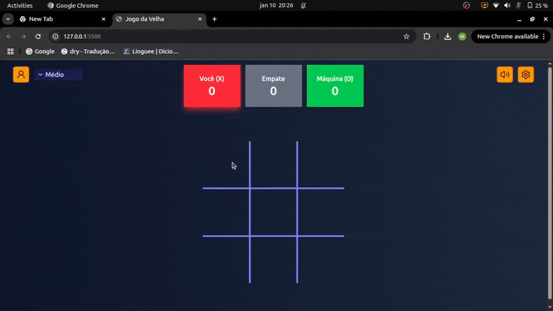

# Jogo da Velha

O jogo da Velha é um famoso jogo para dois jogadores, que consiste em ser o primeiro jogador a alinhar três dos seus símbolos (X ou O) em uma linha contínua horizontal, vertical ou diagonal. Eu desenvolvi esse jogo planejando fixar melhor meus conhecimentos de HTML, CSS e JavaScript.

##  Visão Geral

### Funcionalidades do jogo

O jogo implementado permite o usuário escolher entre jogar de duas pessoas ou jogar individualmente contra o "computador". Foram criados três níveis de dificuldade: o fácil, médio e o impossível.

#### Modo fácil

A estratégia para implementar o modo fácil foi simplesmente o computador jogar aleatoriamente em um quadrado que esteja vazio.

#### Modo médio

No modo médio, o computador começa a ter um desempenho melhor ao utilizar uma lógica de três prioridades:

- 1º Prioridade: Verificar se há alguma jogada que a faça vencer na rodada atual. Se houver, realize essa jogada. Caso contrário, analise a segunda prioridade;

- 2º Prioridade: Verificar se o adversário tem alguma jogada que o permita vencer na próxima rodada. Se houver, bloqueie essa jogada;

- 3º Prioridade: Caso nenhuma das prioridades acima for satisfeita, jogue aleatoriamente em algum quadrado que esteja livre.

#### Modo impossível

No modo impossível, foi implementado o algoritmo Minimax, que é uma técnica de inteligência artificial para tomada de decisões. Essa estratégia consiste em analisar todas as jogadas possíveis, montando uma árvore de decisão contendo todas as possibilidades. 

Assim, o primeiro nível dessa árvore será a jogada do computador, que buscará aquela jogada que tem maior pontuação, enquanto no nível seguinte (que representas as possíveis jogadas do openente), será considerado que o oponente realizará a melhor jogada para minimizar as possibilidades do computador ganhar. Com isso, o computador sempre realizará a melhor jogada possível. 

Para o jogo da velha, essa técnica consegue garantir em tempo viável que o computador nunca perca a partida, somente empate ou ganhe. 

Essa foi uma das partes mais dificies de implementar, pois eu tive que pesquisar sobre como funcionava a implementação dessa técnica, mas com esforço e paciência ela conseguiu sair do papel kkkkk.

#### Outras funcionalidades

Além da funcionalidade do jogador escolher a dificuldade ou jogar de dois, também é possível o jogador escolher se quer jogar com o "X" ou com o "O" acessando o menu de configurações. O jogador pode reiniciar a partida quando ele quiser nesse menu. 

Também foi implementado um quadro de pontuações que marca a quantidade em que o jogador X e O venceram e a quantidade de empates (caso você mude de dificuldade ou o número de jogadores a pontuação é zerada).

Com isso, sempre ao fim do jogo, o usuário pode escolher entre iniciar uma nova partida, adicionando a vitória ou o empate ao placar, ou começar um novo jogo, que irá resetar a pontuação.

### Demonstração do jogo

### Links

- Solução URL: [URL da solução](https://github.com/moisesferreira123/TicTacToe)
- Live Site URL: [Live site URL](https://moisesferreira123.github.io/TicTacToe/)

## Tecnologias Utilizadas

- HTML5
- CSS
- JavaScript
- Tailwind CSS
- Visual Studio Code

## Autor

Desenvolvido por **Moisés Ferreira de Lima**.  
Se você gostou deste projeto, sinta-se à vontade para se conectar comigo:

- GitHub - [@moisesferreira123](https://github.com/moisesferreira123)

- LinkedIn - [Moises Ferreira](https://www.linkedin.com/in/moises-ferreira-099278334/)
